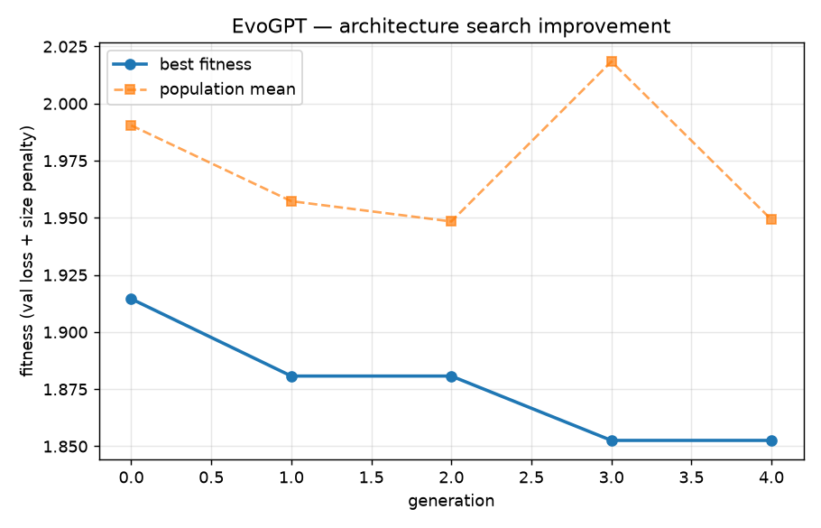
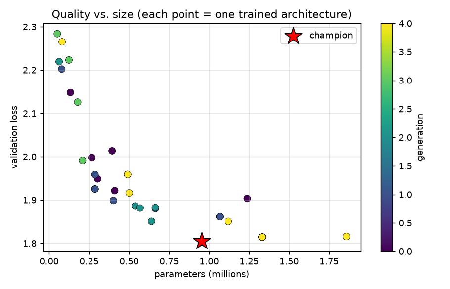
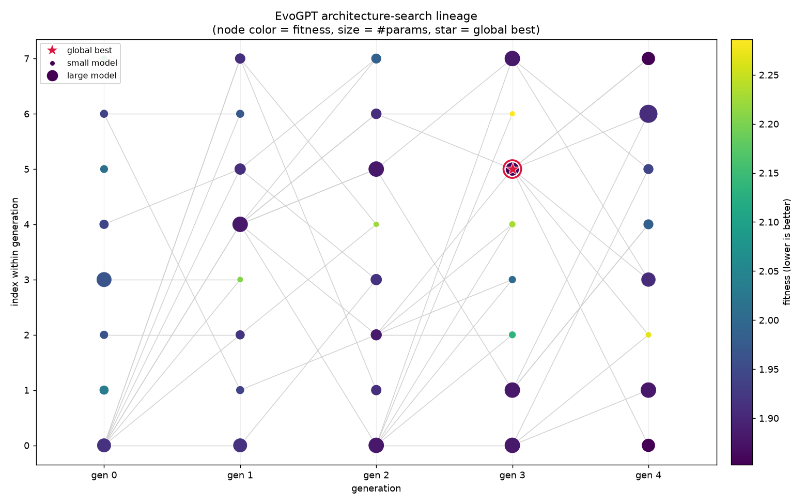
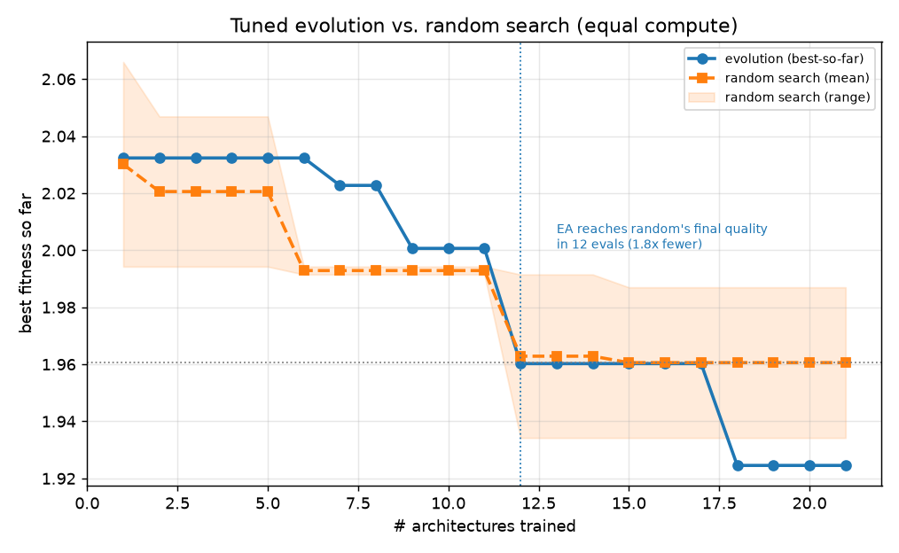
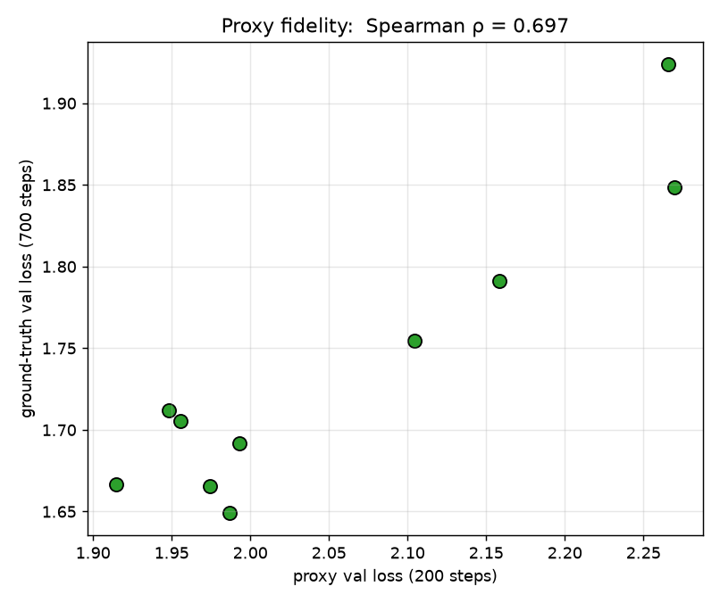
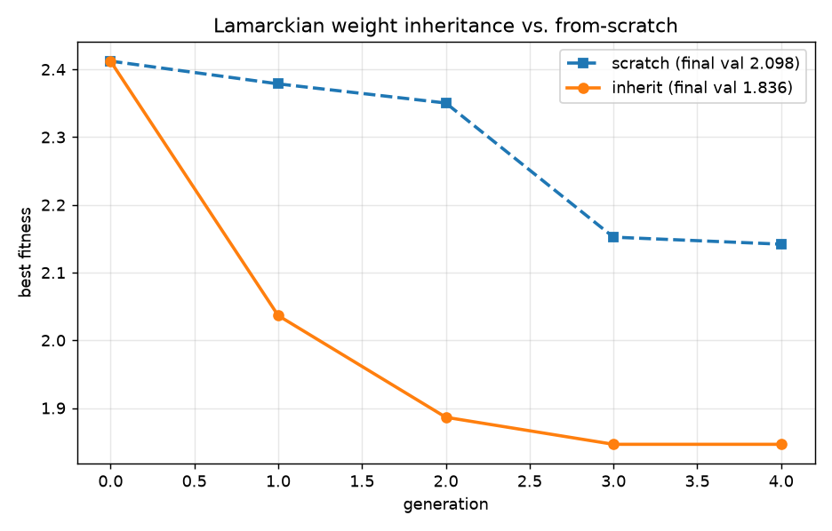

# EvoGPT — Results

Char-level tiny-shakespeare · Apple M3 / PyTorch MPS · all from scratch, no external APIs.

## 1. Evolutionary architecture search

- Search space: **~6912 architectures**
- Evaluated **40** candidates (**28** trained, rest cache hits) over **5** generations
- Best val loss: gen-0 **1.8612** → champion **1.8049**  (**3.0%** better during search)
- Champion genome: `{"n_layer": 3, "d_model": 192, "n_head": 8, "kv_ratio": 4, "mlp_ratio": 2.0, "block_size": 128, "dropout": 0.1}`  (954K params)

- Champion after extended training: **val 1.5177 / ppl 4.56 / 2.190 bits-per-char**







## 2. Does evolution beat random search? (equal compute)

Random search is a famously strong NAS baseline (Li & Talwalkar, 2019), so this is the key honesty check. A first attempt with high mutation tied/lost to random; after tuning the EA to exploit more (mutation 0.18, tournament k=4, more generations) it wins:

- Final best fitness: evolution **1.9246** vs random mean **1.9606** (best random seed 1.9342) → advantage **+0.0360** — **evolution wins**.
- Sample efficiency: evolution reaches random's *final* quality in **12/21 evaluations (1.8× fewer)**.
- Population mean fitness: **2.0774 → 1.9591** — the EA improves the *whole* population; random search has no population-mean improvement by construction.



## 3. Proxy fidelity (is the cheap fitness trustworthy?)

Ranking 10 architectures by **200-step** proxy loss vs **700-step** ground truth: **Spearman ρ = 0.697**, Pearson r = 0.933. The short-training proxy used inside the search approximately preserves the true ranking.



## 4. Lamarckian weight inheritance (A/B)

Same search, children warm-started from the champion's overlapping weights vs from scratch (identical compute budget): final best val **2.0984** (scratch) → **1.8359** (inherit).



## Reproduce
```bash
pip install -e .
python -m experiments.run_all   # full suite
python analyze.py && python experiments/viz_lineage.py && python make_report.py
```
